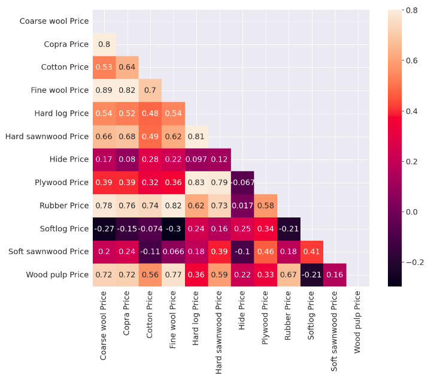
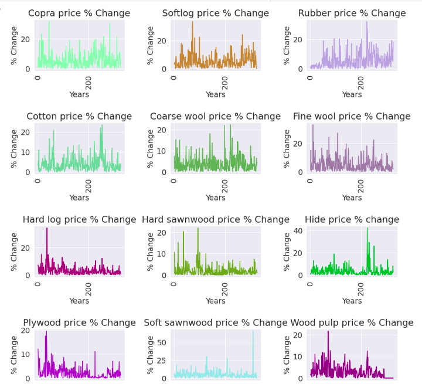
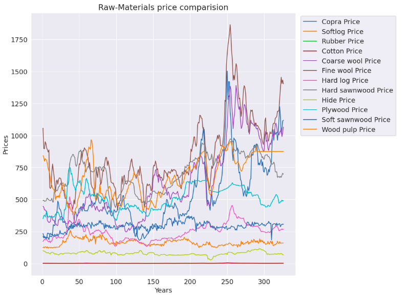
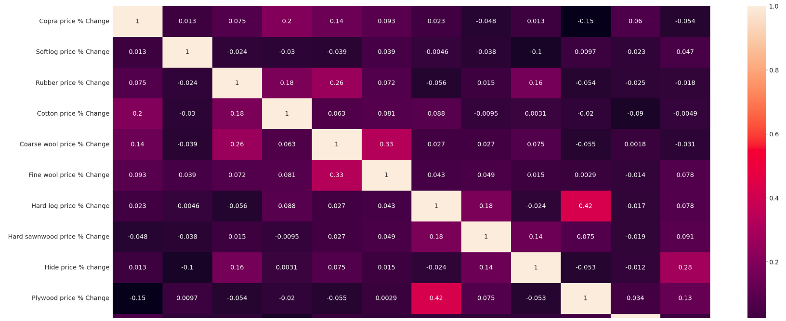

# Projeto de Análise de Dados de Matérias-Primas Agrícolas

## Descrição
Bem-vindo ao "Projeto de Análise de Dados de Matérias-Primas Agrícolas"! Este projeto foi desenvolvido utilizando a linguagem de programação Python e executado no ambiente colaborativo do Google Colab. Nosso objetivo é explorar e compreender profundamente as tendências e padrões dos preços das matérias-primas agrícolas, empregando análises de dados abrangentes e visualizações elucidativas.

## Análises Realizadas
Nossa análise abrange uma série de áreas-chave para fornecer insights valiosos sobre as matérias-primas agrícolas. Algumas das análises incluídas são:

- **Correlação entre Matérias-Primas:** Investigamos as relações interdependentes entre diferentes matérias-primas agrícolas, identificando conexões e influências mútuas.
- **Variação de Preços de Matérias-Primas:** Examinamos as flutuações históricas nos preços de cada matéria-prima, revelando padrões sazonais, tendências de longo prazo e picos de volatilidade.
- **Comparação Percentual de Preços:** Realizamos comparações entre os preços percentuais das matérias-primas, destacando mudanças relativas ao longo do tempo.
- **Visualizações Gráficas Significativas:** Criamos visualizações gráficas intuitivas para representar as análises, tornando os padrões complexos mais acessíveis e compreensíveis.

    
    
    
    

## Contribuições
Estamos entusiasmados com contribuições construtivas para aprimorar ainda mais nosso projeto. Se você identificar problemas, bugs ou tiver sugestões de aprimoramento, convidamos você a abrir uma "issue" ou enviar uma solicitação de "pull request" em nosso repositório.

## Contato
Para perguntas, esclarecimentos ou discussões relacionadas ao projeto, fique à vontade para entrar em contato:

- E-mail: vinicius@bragamatta.com ou vinibm85@gmail.com
- GitHub: [https://github.com/VinicinBraga](https://github.com/VinicinBraga)
- LinkedIn: [https://www.linkedin.com/in/vinícius-braga](https://www.linkedin.com/in/vinícius-braga)

Junte-se a nós enquanto exploramos as nuances das matérias-primas agrícolas por meio de dados e análises detalhadas!